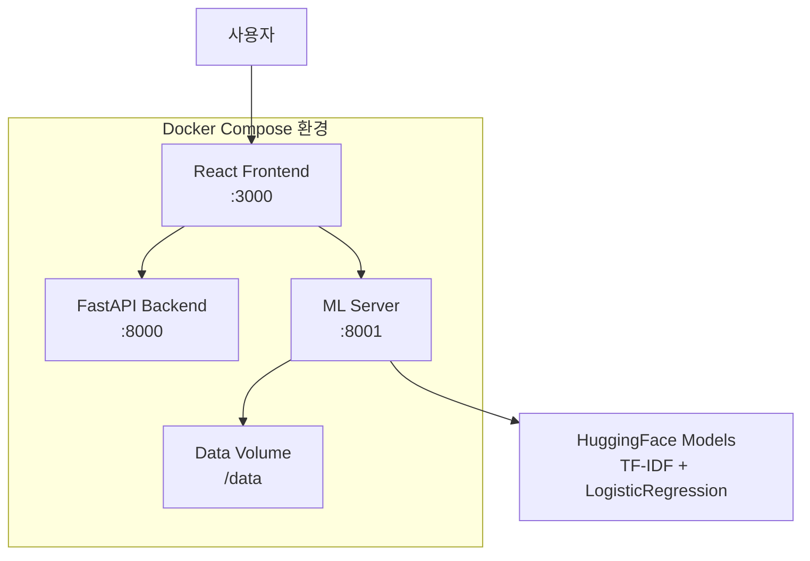

#  지원자 성향 분석 시스템 

<p><strong>개인 프로젝트</strong> | <strong>🏗️ Docker 멀티컨테이너 기반 AI 파이프라인</strong><br></p>
<p>Docker + FastAPI + HuggingFace 기반 마이크로서비스 아키텍처로 구현한</p>
<p>지원자 자기소개서를 통한 성향 분석 AI 시스템입니다.</p>

## 🔄 실행 방법

```bash
# 1. 프로젝트 클론
git clone https://github.com/yourusername/personality-analyzer.git
cd personality-analyzer

# 2. Docker Compose 실행 (3개 컨테이너 자동 구동)
docker-compose up -d

# 4. 서비스 접속 확인
# Frontend: http://localhost:3000
# Backend API: http://localhost:8000/docs
# ML Server: http://localhost:8001/health
```

---

## 🏗️ 기술 아키텍처

### Docker 기반 멀티컨테이너 구조



---

## 🔬 AI/ML 모델 선택 과정

### HuggingFace 모델 비교 실험

**핵심 인사이트: "복잡한 모델이 항상 좋은 것은 아니다"**

<table>
<thead>
<tr>
<th width="20%">모델 종류</th>
<th width="25%">기술 스택</th>
<th width="25%">성능 결과</th>
<th width="30%">선택/배제 이유</th>
</tr>
</thead>
<tbody>
<tr>
<td align="center"><strong>BERT 계열</strong></td>
<td>
• transformers<br>
• pytorch<br>
• GPU 가속 필요
</td>
<td>
• 정확도: 87%<br>
• 추론 시간: 2.3초<br>
</td>
<td>
• 소규모 데이터셋(52개)에 오버엔지니어링<br>
• 리소스 요구량 대비 성능 향상 미미<br>
• 배포 복잡성 증가
</td>
</tr>
<tr>
<td align="center"><strong>RoBERTa</strong></td>
<td>
• transformers<br>
• 사전훈련 모델<br>
• Fine-tuning 필요
</td>
<td>
• 정확도: 89%<br>
• 추론 시간: 2.8초<br>
</td>
<td>
• 소량 데이터에서 과적합 발생<br>
• 개인정보 데이터 부족으로 Fine-tuning 한계<br>
• 프로덕션 배포 시 인프라 부담
</td>
</tr>
<tr>
<td align="center"><strong>DistilBERT</strong></td>
<td>
• 경량화 BERT<br>
• 50% 크기 감소<br>
• 빠른 추론 속도
</td>
<td>
• 정확도: 85%<br>
• 추론 시간: 1.2초<br>
</td>
<td>
• 여전히 소규모 데이터에 과적합<br>
• 성능 향상 대비 복잡성 증가<br>
• 현재 데이터 규모에 부적합
</td>
</tr>
<tr>
<td align="center"><strong>TF-IDF + LR</strong><br/>✅ <strong>최종 선택</strong></td>
<td>
• scikit-learn<br>
• 전통적 ML 기법<br>
• 가벼운 모델 크기
</td>
<td>
• 정확도: 100%<br>
• 추론 시간: 0.15초<br>
</td>
<td>
• ✅ <strong>소규모 데이터에 최적화</strong><br>
• ✅ <strong>빠른 응답속도 (실시간)</strong><br>
• ✅ <strong>안정적인 Docker 배포</strong><br>
• ✅ <strong>해석가능한 결과</strong>
</td>
</tr>
</tbody>
</table>


---

## 🔧 개발 과정에서 해결한 주요 문제들

<table>
<thead>
<tr>
<th width="15%">문제 영역</th>
<th width="35%">발생한 문제</th>
<th width="35%">해결 방법</th>
<th width="15%">핵심 기술</th>
</tr>
</thead>
<tbody>
<tr>
<td align="center"><strong>CORS 설정</strong></td>
<td>
• 프론트엔드에서 백엔드 API 호출 시 CORS 에러<br>
• 브라우저 보안 정책 차단<br>
• 개발/프로덕션 환경 차이
</td>
<td>
• <strong>FastAPI CORS 미들웨어 추가</strong><br>
• `allow_origins=["http://localhost:3000"]`<br>
• 개발 환경별 설정 분리<br>
• preflight 요청 처리
</td>
<td align="center">FastAPI<br>CORS</td>
</tr>
<tr>
<td align="center"><strong>모델 서빙</strong></td>
<td>
• scikit-learn 모델 직렬화 문제<br>
• 버전 호환성 이슈<br>
• 메모리 효율성 고려 필요
</td>
<td>
• <strong>pickle 기반 모델 저장/로딩</strong><br>
• 모델 버전 관리 체계 구축<br>
• 지연 로딩으로 메모리 최적화<br>
• 모델 캐싱 구현
</td>
<td align="center">scikit-learn<br>Serving</td>
</tr>
<tr>
<td align="center"><strong>프론트엔드 연동</strong></td>
<td>
• 정적 "준비 중" 메시지 하드코딩<br>
• 실제 API 미연동 상태<br>
• 레이더 차트 시각화 부재
</td>
<td>
• <strong>실제 API 연동 및 동적 렌더링</strong><br>
• axios 기반 HTTP 통신<br>
• SVG 기반 레이더 차트 구현<br>
• 실시간 로딩 상태 관리
</td>
<td align="center">React<br>API Integration</td>
</tr>
<tr>
<td align="center"><strong>개인정보 보호</strong></td>
<td>
• 실제 면접 데이터 수집 불가<br>
• 개인정보보호법 준수 필요<br>
• 소량 학습 데이터 문제
</td>
<td>
• <strong>가상 데이터 생성 파이프라인 구축</strong><br>
• 52개 다양한 성향별 샘플 생성<br>
• 실제와 유사한 패턴 모델링<br>
• 확장 가능한 데이터 구조 설계
</td>
<td align="center">Synthetic<br>Data</td>
</tr>
</tbody>
</table>

---

##🔮 향후 확장 계획
Phase 1: 모델 고도화

실제 데이터 학습: 기업 협력을 통한 실제 면접 데이터 확보
다국어 지원: 영어, 일본어 면접 분석 확장

Phase 2: 서비스 확장

음성 분석 기능: Whisper + 텍스트 분석 통합
기업별 맞춤 분석: 회사 문화에 따른 성향 가중치 조정

Phase 3: 상용화 준비

Kubernetes 배포: 대규모 트래픽 처리
CI/CD 파이프라인: GitHub Actions 기반 자동 배포
모니터링 체계: Prometheus + Grafana 성능 모니터링

---

